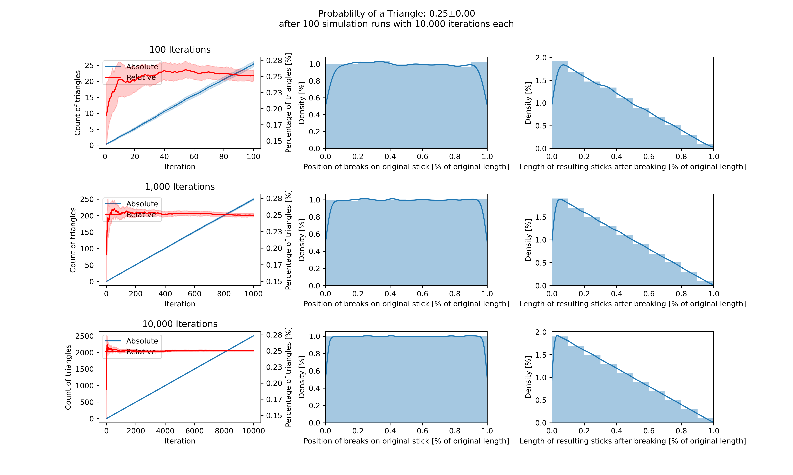

# Broken Stick Problem
Problem: "After breaking a stick at two random points, what is the probability that they form a triangle?"

Just some ideas and fun stuff to solve the broken stick problem.

This repository:
* simulation.py provides a brute-force solution with some nice plots
* pobability.py is intended to calculate the correct solution without overhead
* img-folder is for the generated plots

## Simulation
Since we need a value that confirms our statistical approaches, we calculate a probability value by a simulation of many iterations of breaking a stick.

The idea of the simulation is described in the following.

**Results:**
We see, that the probability of a triangle converges to 25% after enough iterations (here: 10_000) and this is valid over several runs as well (here: 100).

**Assumptions**
- Stick has a length of 1
- Distribution of each breakpoint is independent and univariately distributed over the length of the stick

**Calculation:** 10,000 iterations of virtual stick breaking
- Resulting stick lengths are differences between the start of the stick (0), both breakpoints (sorted ascending), and the maximum (1)
- Increase number of triangles if all resulting stick lengths are <= 0.5 (if stick lengths is >= 0.5 it is not possible to create a triangle)
- Caculate percentage of triangles in all iterations
  
**Verification:** 100 runs of the calculations and plotting of distributions
- breakpoint distributions should be equally distributed
- resulting stick lengths should be rather shorter than longer
- number and percentage of resulting triangles should converge
- confidence intervals should converge

## Probabilitstic Solution
* [Stochastic solution with the help of integrals](probability.ipynb)

## 3rd Party Solutions
Of course, there are many solutions out there by many brilliant minds. See the following resources if you are looking for a specific approach:
* [Mathematical/Visual solution of all possible breakpoint combinations](https://services.math.duke.edu/education/webfeatsII/gdrive/Team%20D/project/brokenstick.htm)
* [Interview question at Google](https://www.glassdoor.com/Interview/What-is-the-probability-of-breaking-a-stick-into-3-pieces-and-forming-a-triangle-QTN_12830.htm): Interesting approaches, especially the statistical approach:
> Suppose x is the length of the first piece and y is the length of the second piece (both must be nonnegative). Then y will be &lt;= 1-x, and to be able to form a triangle, y must be &lt;= .5 - x with x &lt;= .5. The probability of being able to form a triangle is the area of the second set of (x,y) pairs divided by the area of the first set of (x,y) pairs, which is .125/.5 = .25.
